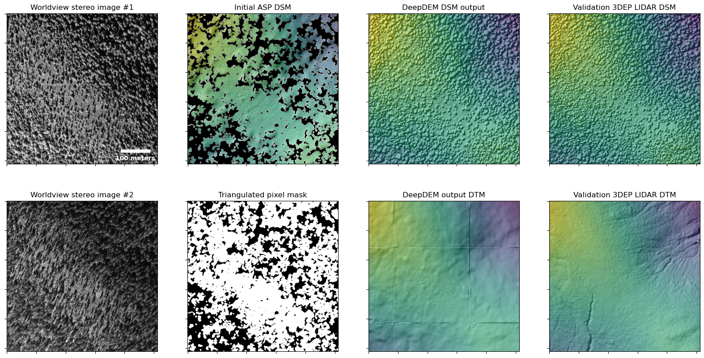

# DeepDEM

[](https://doi.org/10.5281/zenodo.14270049)

This repository demonstrates the use of deep learning as an intelligent post-processing filter in refining digital surface models (DSMs) generated from satellite imagery.

<p align="center">

</p>

DeepDEM is a deep learning framework that uses a UNet architecture with a ResNet based encoder to perform residual refinement for digital surface models. The model accepts orthorectified stereo satellite images and an initial DSM estimate (along with other ancilliary inputs) and calculates residuals that minimize the L1 loss when comparing the initial DSM to ground truth data. The model can be trained on both DSMs and Digital Terrain Models (DTMs) to either refine the initial DSM estimate, or retrieve terrain underneath sparse vegetation.

## Overview of repository
This repository contains code in the form of Jupyter notebooks and Python scripts needed to train and generate inferences from satellite imagery and initial DSM estimates. It is assumed that the user has access to stereo satellite imagery and is familar with stereogrammetry tools (we use the [Ames Stereo Pipeline (ASP) software package](https://stereopipeline.readthedocs.io/en/latest/introduction.html)) to generate the inputs needed for DeepDEM.

## DeepDEM in action
<p align="center">

</p>

<p align="center">

</p>

These plots show an example of satellite stereo image inputs to the model (far left), along with the intial DSM (second column top) and mask of valid pixels for which a DSM estimate was generated using ASP (second column bottom). The model inferences (hillshaded DSM/DTM) are shown in the third column, along with ground truth LIDAR in the last column.

## Using this repository

### Installing dependencies
Once the repository is cloned, the `environment.yml` file can be used to create an conda environment with the required dependencies. We recommend using [`mamba`](https://github.com/conda-forge/miniforge) to speed up the install process. The environment is created and activated by the following commands from the root directory of the repository:

```
mamba env create -f environment.yml
...
mamba activate deep_dem
```
### Prerequisites
It is expected that user has access to panchromatic (single channel) stereo satellite imagery, which has been processed using software such ASP to produce orthorectified images, along with a map of [triangulation errors](https://stereopipeline.readthedocs.io/en/latest/correlation.html#triangulation-error). The option to download USGS 3DEP LIDAR data and generate DSMs/DTMs is available through the notebook `0_Download_LIDAR_data.ipynb`

### ML libraries
DeepDEM primarily uses [PyTorch-lightning](https://github.com/Lightning-AI/pytorch-lightning), [TorchGeo](https://github.com/microsoft/torchgeo), and [Segmentation Models for PyTorch](https://github.com/qubvel-org/segmentation_models.pytorch)

### Notebooks
The notebooks are labeled in the sequence of execution for a general use case. Users begin by downloading [USGS 3DEP data](https://www.usgs.gov/3d-elevation-program) (if available) for their study site (`0a_Download_LIDAR_data.ipynb`) and HLS data (`0b_Download_HLS_data.ipynb`). If relevant LIDAR data is available through 3DEP, the `0a_Download_LIDAR_data.ipynb` notebook can be used to generate either a DSM or a DTM. Along with the stereo images, initial DSM and map of triangulation errors (generated using tools like ASP), the rasters are ready for preprocessing (`0c_Data_Preprocessing.ipynb`) which reprojects all rasters to the same CRS, calculates an NDVI raster, calculates a nodata mask raster and applies adaptive histogram normalization to the satellite imagery. The rasters are now ready to be used by the model for training.

As part of the model training, the input DSM are scaled by the sample mean and a global scaling factor that is pre-computed across a scene. This scaling factor is chip size dependent, and is calculated for reference in the `0d_Calculating_Scale_Factor.ipynb` notebook. *Note: the user has to manually override model defaults with values produced by this notebook during training/inference for it to work correctly for their datasets*

The notebook `1a_TrainDeepDEM.ipynb` demonstrates training the DeepDEM model for the "standard" case of using a pair of stereo images, an initial DSM and associated triangulation error map, NDVI data and a no-data mask as the input channels. The ground truth for the results demonstrated here are obtained from the [3DEP LIDAR survey of Mt Baker in 2015](https://data.usgs.gov/datacatalog/data/USGS:58518b0ee4b0f99207c4f12c).

### Scripts and modules
A more expansive example of model training is provided under `scripts/1a_TrainDeepDEM.py`. This script show how training parameters can be changed for various experiments, including model architecture, model inputs, and training hyperpameters.

Inference script: 

The code for the model dataloader is given in `scripts/dataset_modules.py`. This module defines `TorchGeo` derived classes that are used to define `Datasets` and `DataModules`. `Datasets` groups together raster files that comprise an area of study, making it easy to query spatial/temporal bounds, calculate raster statistics for each layer, and is a part of the internal plumbing to pass around data during training and inference. `DataModules` are a [Pytorch-Lightning](https://lightning.ai/docs/pytorch/stable/data/datamodule.html) concept which is also implemented in `TorchGeo`, which encapsulates all of the methods needed to process data during model training, namely setting up dataloaders, and moving data between CPU/GPU.

`scripts/task_module.py` defines the `DeepDEMRegressionTask` class, which defines the DeepDEM model and all of the associated methods, such as `training_step`, `validation_step` and the primary method to pipe data through the model, `forward`. This class also defines the default data global scaling factors (`GSF_DICT`) which can be overridden by passing in a dictionary of values during model initialization.

### Introducing new datasets
Code in this repository can be used to train new models, as well as generate inferences on datasets which contain the necessary input layers (orthorectified imagery, initial DSM estimate, triangulation errors)

### Trained models

### Sample outputs

## Paper

# 

## License

## Citation
See CITATION.cff

## Additional notes
This work is based on the [ResDepth](https://github.com/prs-eth/ResDepth/) work of Stucker et al. (2021), but extends the application to vegetation and natural surfaces and uses LIDAR data as a source of ground truth in place of well defined CAD models. The work here also demonstrates using this approach to generate DTMs from satellite imagery and and an initially derived DSM. We also explore the utility of additional input layers, self consistent orthorectification, and improved network architectures towards refining initial estimates of DSMs generated using photogrammetry.
